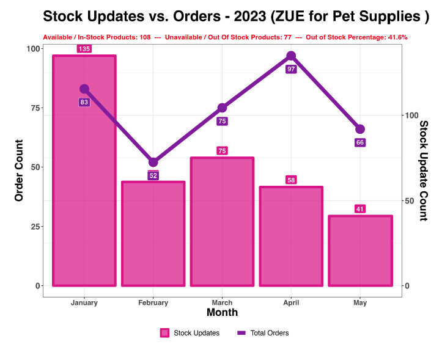

```{r setup, include=FALSE}
knitr::opts_chunk$set(echo = FALSE)
```


```{r, out.width='22%', fig.align='left'}
knitr::include_graphics("https://petsmarket.com/assets/images/pay_logo.svg")
```

<hr style="border-bottom: 1px solid #000;">


<div style="font-weight: normal; font-family: Arial, sans-serif; font-size: 16px; text-align: right;">`r format(Sys.Date(), "%A, %B %d, %Y")`</div>
<BR>
<div style="font-size: 23px; font-weight: bold; text-align: center;">Stock Update vs Order - Report</div>

<div style="font-size: 14.5px; text-align: left;">

Dear Partner,
<BR><BR>
In regard to the mentioned subject, we would like to share a monthly significant report describing the stock updates in 2023 which reflects and quantifies the order sales volume.
</div>

<center>

</center>

<div style="font-size: 14.5px; font-family: Arial; text-align: left; margin-left: 20px;">

- In order to maximize your sales, a continuous update of the stock inventory will always help in boosting and improving the revenue.

- Additionally, the out-of-stock percentage should not exceed 25% else the visibility of your products exposure to Petsmarket clients will decrease and will have an effect on sales conversion.
</div>
<BR>
<div style="font-size: 14.5px; font-family: Arial; text-align: left; margin-left: 20px;">
Regards,
<BR>
Petsmarket Team
</div>


